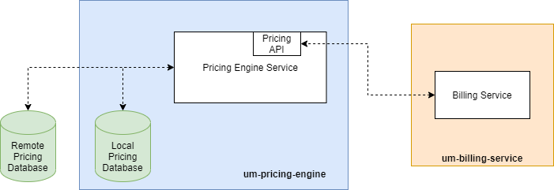

[[mainOverview]]
= Overview

== Building Block Overview

[NOTE]
.Content Description
================================
This section contains:

* High-Level Description of the Building Block
* Context within EOEPCA
================================

The main functionality of the Pricing Engine is to support:

* The Billing Service during the generation of billing reports, calculation of rates and prices for a list of items within a Pricing Window. Disaggregating them when necessary, depending on the pricing models.
* The Authorization Phase, because the pricing engine can also be consulted for estimated resource use, to support the PDP on their requests to the Billing Service.

=== Initialization flow

The figure below, identifies the main workflows on which the Pricing Engine participates, along with it's components:

When launched, the Pricing Engine will answer to all requests to 1 specific paths:

. Pricing Events: To calculate the rates and prices for a list of items.
The requests should be accompained by an "Authorization: Bearer <valid_RPT>".

Examples, given the example values of:
- For Pricing Events: to be determinated

[cols="4*"]
|===
| Token | Request to Pricing Engine | Pricing Engine Action | Pricing Engine answer

| No RPT/OAuth token | pricing.domain.com | None (request does not get to Pricing endpoint) | None (the Pricing Engine doesn't see this request)
| RPT/OAuth token + Policy information as data  | pdp.domain.com/policy/ | Register Policy in the Back-end Database | Policy_id for the policy just created 

|===

== External Interfaces

=== Exposed Interfaces

==== Pricing Engine API

The PDP queries the corresponding PDP to retrieve information about a policy.
For this case we can use the `/policy/<policy_id or ObjectId(policy_id)>` to do all the operations related to insert, get, update and delete policies.

=== Consumed Interfaces

==== OIDC (to Login Service) 

==== SCIM (to Login Service)

=== Back-End databases

The Pricing Engine will connect to remote pricing databases to get price for the components that have generated the Billing Requests.

== Internal Interfaces

=== Back-End database

The Pricing Engine will also have local pricing databases to get the price for the components.

== Required resources

[NOTE]
.Content Description
================================
This section contains:

* List of HW and SW required resources for the correct functioning of the building Block
* References to open repositories (when applicable)

================================

=== Software

The following Open-Source Software is required to support the deployment and integration of the Pricing Engine:

* EOEPCA's SCIM Client - https://github.com/EOEPCA/um-common-scim-client
* EOEPCA's OpenID - https://github.com/EOEPCA/um-common-oidc-client
* EOEPCA's Well Known Handler - https://github.com/EOEPCA/well-known-handler
* Flask - https://github.com/pallets/flask
* MongoDB for python - https://pymongo.readthedocs.io/en/stable/index.html

== Static Architecture 

[NOTE]
.Content Description
================================
This section contains:

* Diagram and description of the major logical components within the Building Block

================================

With the diagram below, you can see how the connection between the remote back-end databases, local back-end database and the Pricing Engine:

The Pricing Engine is composed of three main components:

* The Pricing Engine (related to the endpoint that are exposed): This component will expose the endpoints that we commented before. For this it will be necessary to establish a client for SCIM and another for OIDC.

* A local Back-end Database: This component store all information related to prices locally and will interact within the endpoints.

* A remote Back-end Database: This component also store the information related to prices but in this case remotely.

The next section <<mainDesign>>:: contains detailed descriptions and references needed to understand the intricacies of this component.

== Use cases

[NOTE]
.Content Description
================================
This section contains:

* Diagrams and definition of the use cases covered by this Building Block

================================

=== Policy Access Check Use Case

image::../images/use_case.png[top=5%, align=center]

This diagram covers the following use cases:

==== Policy Access Check

When the PDP has obtained the policies, we proceed to compare the content of these policies with the values obtained from the request using the ScimHandler, mainly they are the resource id, action type, and the user_name, in case that some of these do not coincide, it will be response with "Deny" in the json or with a "Permit" if everything is correct.

==== Policy Retrieval

The PDP access through the resource id that was extracted from the XACML in the request and using the Policy_Storage class, allows to access the Back-end databse and extracts all the policies information stored for that resource id.

==== Get User Attributes

SCIM will be used in order to obtain the attributes for the user that have been extracted from the XACML of the request and then use them in the PDP functions. The issuer variable of the XACML subject-id field can be optionally used to determine the SCIM Endpoint on which the PDP will attempt to perform attribute release. If this value is not available, it will be extracted from configuration or environment variables.

=== Policy Repository Management

==== Registration of policies

The process of registering the policies is performed in the main, for this purpose the Policy_Storage class is used which will allow actions such as inserting policies in the pod where the Back-end database is located.

=== Policy Delegation (to external PDPs)

Whenever a policy rule has a **delegate** parameter with a reference URI to an external PDP, the current PDP will forward the xacml request to the external PDP referencing itself in it. The external PDP will validate the remaining policies (that were referenced with the **delegate** parameter). If the external PDP has the policy, it will return a permission granted on its side. If all the policy checks are positively validated (current PDP and foreign PDP(s)), the permission is granted. If otherwise any policy check fails to validate, the permission is denied.