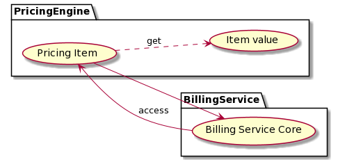

[[mainOverview]]
= Overview

== Building Block Overview

[NOTE]
.Content Description
================================
This section contains:

* High-Level Description of the Building Block
* Context within EOEPCA
================================

The main functionality of the Pricing Engine is to support:

* The Billing Service during the generation of billing reports, calculation of rates and prices for a list of items within a Pricing Window. Disaggregating them when necessary, depending on the pricing models.
* The Authorization Phase, because the pricing engine can also be consulted for estimated resource use, to support the PDP on their requests to the Billing Service.

=== Initialization flow

The figure below, identifies the main workflows on which the Pricing Engine participates, along with it's components:

image::../images/pricing_flow.png[top=5%, align=right, pdfwidth=6.5in]

When launched, the Pricing Engine will answer to all requests to 1 specific paths:

. Pricing Events: To calculate the rates and prices for a list of items.
The requests should be accompained by an "Authorization: Bearer <valid_RPT>".

Examples, given the example values of:
- For Pricing Events: to be determinated

[cols="4*"]
|===
| Token | Request to Pricing Engine | Pricing Engine Action | Pricing Engine answer

| No RPT/OAuth token | pricing.domain.com | None (request does not get to Pricing endpoint) | None (the Pricing Engine doesn't see this request)
| RPT/OAuth token + Item information as data  | pricing.domain.com/pricing/ | Get the value for the item from the back-end database | Value for the item

|===

== External Interfaces

=== Exposed Interfaces

==== Pricing Engine API

For this case we can use the `/pricing/<item_id or ObjectId(item_id)>` to do all the operations related to get the value for the item.

=== Consumed Interfaces

==== OIDC (to Login Service)

To be determinated

==== SCIM (to Login Service)

To be determinated

=== Back-End databases

The Pricing Engine will connect to remote pricing databases to get price for the components that have generated the Billing Requests.

== Internal Interfaces

=== Back-End database

The Pricing Engine will also have local pricing databases to get the price for the components.

== Required resources

[NOTE]
.Content Description
================================
This section contains:

* List of HW and SW required resources for the correct functioning of the building Block
* References to open repositories (when applicable)

================================

=== Software

The following Open-Source Software is required to support the deployment and integration of the Pricing Engine:

* EOEPCA's SCIM Client - https://github.com/EOEPCA/um-common-scim-client
* EOEPCA's OpenID - https://github.com/EOEPCA/um-common-oidc-client
* EOEPCA's Well Known Handler - https://github.com/EOEPCA/well-known-handler
* Flask - https://github.com/pallets/flask
* MongoDB for python - https://pymongo.readthedocs.io/en/stable/index.html

== Static Architecture 

[NOTE]
.Content Description
================================
This section contains:

* Diagram and description of the major logical components within the Building Block

================================

With the diagram below, you can see how the connection between the remote back-end databases, local back-end database and the Pricing Engine:

image::../images/pricing_flow.png[top=5%, align=right, pdfwidth=6.5in]

The Pricing Engine is composed of three main components:

* The Pricing Engine (related to the endpoint that are exposed): This component will expose the endpoints that we commented before. For this it will be necessary to establish a client for SCIM and another for OIDC.

* A local Back-end Database: This component store all information related to prices locally and will interact within the endpoints.

* A remote Back-end Database: This component also store the information related to prices but in this case remotely.

The next section <<mainDesign>>:: contains detailed descriptions and references needed to understand the intricacies of this component.

== Use cases

[NOTE]
.Content Description
================================
This section contains:

* Diagrams and definition of the use cases covered by this Building Block

================================

=== Pricing 

This diagram covers the following use cases:

==== Pricing Item Value

When the Billing Service generates billing reports, the Pricing Engine building block calculates rates and prices for a list of items.

==== Registration of values

The process of registering the values for the items is performed in the main, for this purpose the Price_Storage class is used which will allow actions such as inserting prices in the pod where the Back-end database is located or in remote Back-end database.

